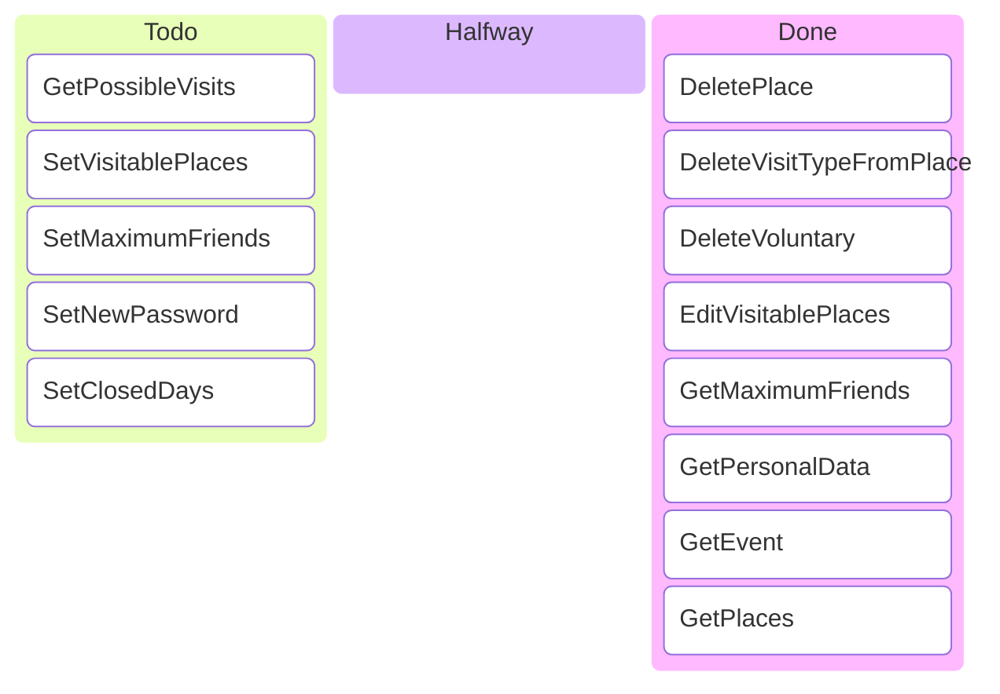

# Configurator

```mermaid
kanban
  todo[Todo]
    GetPossibleVisits
    SetVisitablePlaces
    SetMaximumFriends
    SetNewPassword
    SetClosedDays
  halfway[Halfway]

  done[Done]
    DeletePlace 
    DeleteVisitTypeFromPlace
    DeleteVoluntary 
    EditVisitablePlaces
    GetMaximumFriends
    GetPersonalData 
    GetEvent
    GetPlaces
```

