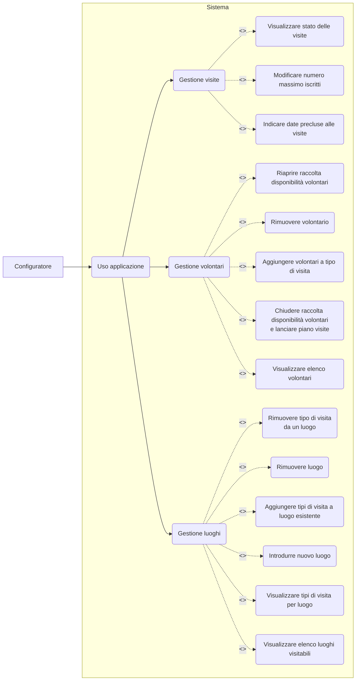
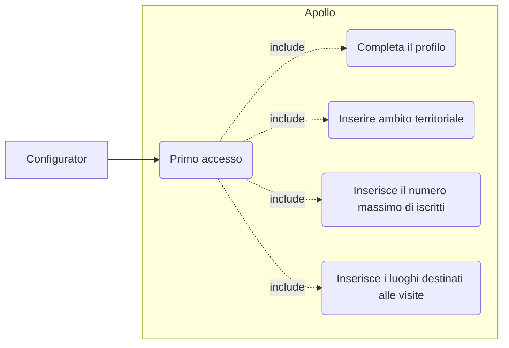
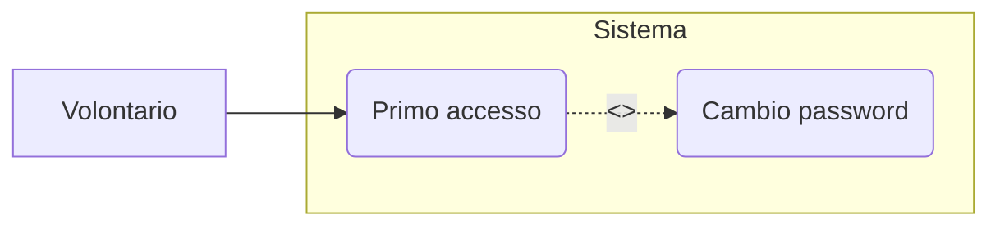
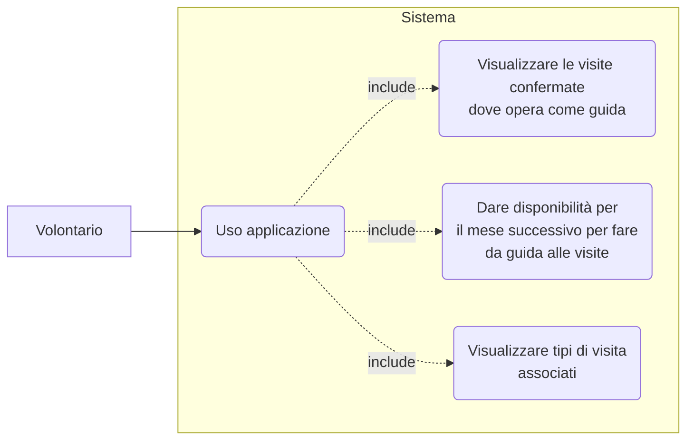
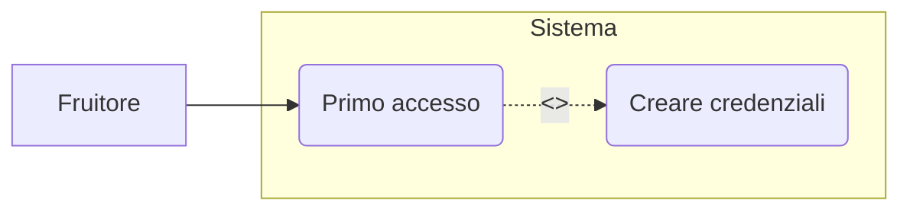
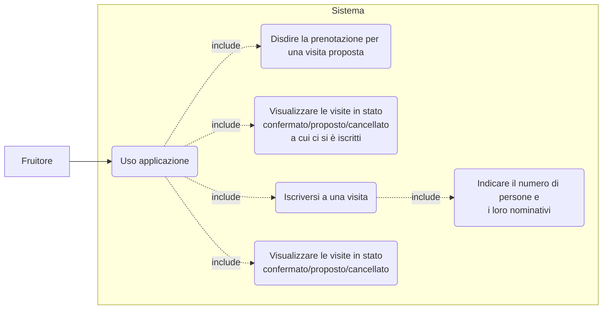

# UML casi d'uso

## Configuratore

### Primo accesso

```mermaid
flowchart LR
    Configuratore["Configuratore"]

    subgraph Sistema["Sistema"]
        UsoApp("Uso applicazione")

        GestioneVisite("Gestione visite")
        VisStato("Visualizzare stato delle visite")
        ModNum("Modificare numero massimo iscritti")
        IndDate("Indicare date precluse alle visite")

        GestioneVolontari("Gestione volontari")
        RiapreRacc("Riaprire raccolta disponibilità volontari")
        RimVol("Rimuovere volontario")
        AggVol("Aggiungere volontari a tipo di visita")
        ChiudiRacc("Chiudere raccolta disponibilità volontari\ne lanciare piano visite")
        VisVol("Visualizzare elenco volontari")

        GestioneLuoghi("Gestione luoghi")
        RimTipoVis("Rimuovere tipo di visita\nda un luogo")
        RimLuo("Rimuovere luogo")
        AggTipoVis("Aggiungere tipi di visita a luogo esistente")
        IntLuo("Introdurre nuovo luogo")
        VisTipiLuo("Visualizzare tipi di visita per luogo")
        VisLuo("Visualizzare elenco luoghi visitabili")
    end

    Configuratore --> UsoApp
    UsoApp --> GestioneVisite
    UsoApp --> GestioneVolontari
    UsoApp --> GestioneLuoghi

    GestioneVisite -. "<<include>>" .-> VisStato
    GestioneVisite -. "<<include>>" .-> ModNum
    GestioneVisite -. "<<include>>" .-> IndDate

    GestioneVolontari -. "<<include>>" .-> RiapreRacc
    GestioneVolontari -. "<<include>>" .-> RimVol
    GestioneVolontari -. "<<include>>" .-> AggVol
    GestioneVolontari -. "<<include>>" .-> ChiudiRacc
    GestioneVolontari -. "<<include>>" .-> VisVol

    GestioneLuoghi -. "<<include>>" .-> RimTipoVis
    GestioneLuoghi -. "<<include>>" .-> RimLuo
    GestioneLuoghi -. "<<include>>" .-> AggTipoVis
    GestioneLuoghi -. "<<include>>" .-> IntLuo
    GestioneLuoghi -. "<<include>>" .-> VisTipiLuo
    GestioneLuoghi -. "<<include>>" .-> VisLuo
```

### Uso

```mermaid
flowchart LR
    Customer["Configurator"]

    subgraph Apollo["Apollo"]
        FirstAccess("Primo accesso")
        FinalizeProfile("Completa il profilo")
        InsertTerritory("Inserire ambito territoriale")
        SetMaximumFriends("Inserisce il numero massimo di iscritti")
        SetVisitPlaces("Inserisce i luoghi destinati alle visite")
    end

    Customer --> FirstAccess
    FirstAccess -. "include" .-> FinalizeProfile
    FirstAccess -. "include" .-> InsertTerritory
    FirstAccess -. "include" .-> SetMaximumFriends
    FirstAccess -. "include" .-> SetVisitPlaces
```

## Volontario

### Primo accesso

```mermaid
flowchart LR
    Volontario["Volontario"]

    subgraph Sistema["Sistema"]
        PrimoAccesso("Primo accesso")
        CambioPassword("Cambio password")
    end

    Volontario --> PrimoAccesso
    PrimoAccesso -. "<<include>>" .-> CambioPassword
```

### Uso

```mermaid
flowchart LR
    Volontario["Volontario"]

    subgraph Sistema["Sistema"]
        UsoApp("Uso applicazione")
        VisiteConf("Visualizzare le visite confermate\ndove opera come guida")
        DispMese("Dare disponibilità per\nil mese successivo per fare\nda guida alle visite")
        TipiVisita("Visualizzare tipi di visita\nassociati")
    end

    Volontario --> UsoApp
    UsoApp -. "include" .-> VisiteConf
    UsoApp -. "include" .-> DispMese
    UsoApp -. "include" .-> TipiVisita
```

## Utente finale

### Primo accesso

```mermaid
flowchart LR
    Fruitore["Fruitore"]

    subgraph Sistema["Sistema"]
        PrimoAccesso("Primo accesso")
        CreareCredenziali("Creare credenziali")
    end

    Fruitore --> PrimoAccesso
    PrimoAccesso -. "<<include>>" .-> CreareCredenziali
```

### Uso

```mermaid
flowchart LR
    Fruitore["Fruitore"]

    subgraph Sistema["Sistema"]
        UsoApp("Uso applicazione")
        Disdire("Disdire la prenotazione per una visita proposta")
        VisiteIscritto("Visualizzare le visite in stato\nconfermato/proposto/cancellato\na cui ci si è iscritti")
        Iscriversi("Iscriversi a una visita")
        IndicarePersone("Indicare il numero di persone e\ni loro nominativi")
        VisiteTutte("Visualizzare le visite in stato\nconfermato/proposto/cancellato")
    end

    Fruitore --> UsoApp
    UsoApp -. "include" .-> Disdire
    UsoApp -. "include" .-> VisiteIscritto
    UsoApp -. "include" .-> Iscriversi
    UsoApp -. "include" .-> VisiteTutte
    Iscriversi -. "include" .-> IndicarePersone
```